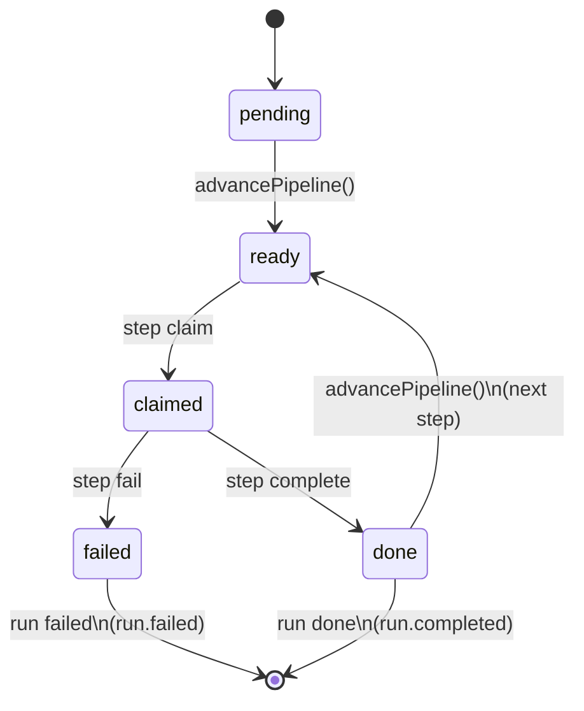

# Singularity Architecture

Singularity is a **workflow orchestrator** that executes runs composed of ordered steps.

- Workflows are defined on disk (a “workflows directory”).
- Runtime state (runs, steps, events, agents, cron metadata, etc.) is persisted in a **SQLite** database.
- Execution is performed by **OpenClaw agents** that poll for work (typically via cron) and run CLI commands (`singularity step claim/complete/fail`).

This repo is a monorepo containing both the **SDK** (used by Horizon and other clients) and the **CLI/runtime** that manipulates the state DB and advances the pipeline.

## Monorepo layout

- **SDK package**: `packages/singularity/`
  - Public entry: `packages/singularity/src/index.ts`
  - SDK factory: `packages/singularity/src/client.ts` (creates the SDK client)
  - Modules: `packages/singularity/src/modules/*` (agents, workflows, activity, cron, database, skills, usage, …)
  - Transport: `packages/singularity/src/transport/*`
  - Types/errors/utils: `packages/singularity/src/{types,errors,utils}.ts`

- **CLI/runtime package**: `packages/singularity-cli/`
  - CLI entry: `packages/singularity-cli/src/cli.ts`
  - Command router / subcommands: `packages/singularity-cli/src/commands/**`
    - Steps: `packages/singularity-cli/src/commands/step/{claim,complete,fail,stories}.ts`
    - Workflows: `packages/singularity-cli/src/commands/workflow/{list,run,status,runs,stop,resume,install,uninstall}.ts`
  - State DB helpers: `packages/singularity-cli/src/db.ts`
  - Pipeline advancement: `packages/singularity-cli/src/pipeline.ts` (`advancePipeline(runId)`)
  - Paths/config: `packages/singularity-cli/src/paths.ts`
  - Installer + workflow parsing/build: `packages/singularity-cli/src/installer/**`

- Conceptual overview: `setup.md`

## High-level runtime model

1. A run is created (typically via CLI or via a client using the SDK).
2. Steps are inserted into SQLite with initial status (commonly `pending`).
3. The pipeline “advances” by marking the next pending step as `ready`.
4. Agents poll and claim ready steps.
5. Agents complete/fail steps and the pipeline advances until the run is `done` or `failed`.

The authoritative sequencing logic lives in the CLI/runtime pipeline code.

## Diagram: CLI/runtime components

```mermaid
flowchart TB
  subgraph CLI[packages/singularity-cli]
    Entry[src/cli.ts\nArgument parsing + command dispatch]
    Cmds[src/commands/**\ninstall/workflow/step/...]
    DB[src/db.ts\nSQLite helpers + events]
    Pipe[src/pipeline.ts\nadvancePipeline(runId)]
    Paths[src/paths.ts\nresolve state/workflow paths]
    Inst[src/installer/**\nworkflow install/build/step generation]
  end

  Entry --> Cmds
  Cmds --> DB
  Cmds --> Pipe
  Cmds --> Inst
  Cmds --> Paths

  DB --> State[(SQLite state DB)]
  Pipe --> State
  Inst --> WF[Workflows on disk\n(workflows dir)]
  Cmds --> WF

  Agent[OpenClaw Agent\n(cron)] -->|singularity step claim| Cmds
  Agent -->|singularity step complete/fail| Cmds
```

## Diagram: step lifecycle + pipeline advancement

The pipeline advancement behavior is implemented in `packages/singularity-cli/src/pipeline.ts`:

- When all steps are `done` → mark run `done` and emit `run.completed`
- When any step is `failed` and there is no next pending step → mark run `failed` and emit `run.failed`
- When there is a next `pending` step → mark it `ready` and emit `step.ready`



## Diagram: SDK composition (client + modules + transport)

The SDK is designed as a thin client composed of modules (agents/workflows/activity/…) over a transport.

```mermaid
flowchart LR
  subgraph SDK[packages/singularity]
    Factory[src/client.ts\ncreateSingularitySDK(...)]
    Mods[src/modules/*\nagents, workflows, activity, cron, ...]
    Types[src/types.ts]
    Err[src/errors.ts]
    Util[src/utils.ts]
    Trans[src/transport/*]
  end

  Factory --> Mods
  Mods --> Trans
  Mods --> Types
  Mods --> Err
  Mods --> Util

  Trans -->|calls| Runtime[Singularity runtime\n(CLI + SQLite + filesystem)]
```

## Key invariants / patterns

- **Single source of truth is the SQLite state DB** (runs, steps, events).
- **Steps advance serially** via `advancePipeline(runId)` (`packages/singularity-cli/src/pipeline.ts`).
- **Agent outputs as structured variables**: step runners often print `KEY: value` lines; the orchestrator can treat these as variables for later steps/templates.
- **Polling execution model**: OpenClaw agents claim work by polling (cron) rather than being pushed work.

## How to update the diagrams

- Diagrams are Mermaid blocks inside this markdown file.
- Edit in place; keep diagrams aligned with real code paths under `packages/singularity-cli/src/**` and `packages/singularity/src/**`.
