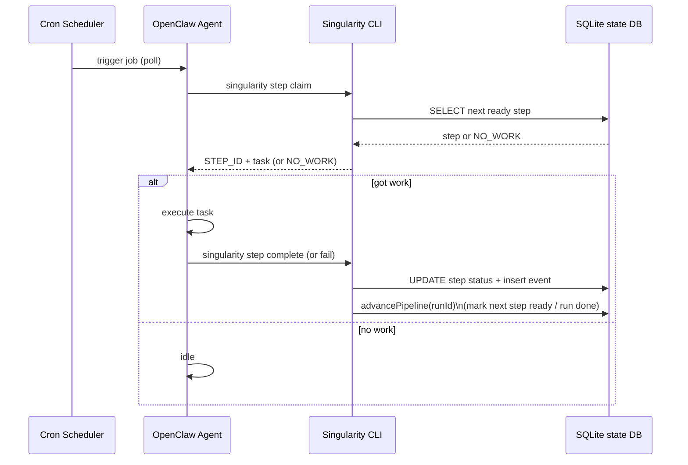

# System Integration Architecture (Horizon + OpenClaw + Singularity)

This document shows how the main pieces fit together:

- **Horizon**: Next.js dashboard (browser UI + server route handlers)
- **Singularity SDK** (`@wezdev/singularity`): client library used by Horizon (and other tools)
- **Singularity CLI** (`packages/singularity-cli`): runtime + state machine for steps/runs
- **SQLite state DB**: the system-of-record for runs/steps/events
- **OpenClaw gateway/daemon + agents**: execution substrate; agents poll for steps and run them

## Integration diagram

```mermaid
flowchart LR
  Human[Human User\n(Browser)] -->|HTTP| Horizon[Horizon Dashboard\n(Next.js App Router)]

  subgraph HorizonBox[Horizon]
    UI[app/components/**\nUI components]
    API[app/api/**/route.ts\nRoute Handlers]
  end

  Horizon --> UI
  UI -->|fetch| API

  API -->|uses| SDK[@wezdev/singularity\n(Singularity SDK)]

  subgraph SingularityBox[Singularity]
    CLI[singularity CLI\n(packages/singularity-cli)]
    DB[(SQLite state DB)]
    WDIR[Workflows directory\n(YAML + assets)]
  end

  SDK --> DB
  SDK --> WDIR

  CLI --> DB
  CLI --> WDIR

  subgraph OpenClawBox[OpenClaw]
    GW[OpenClaw Gateway/Daemon]
    Agent[OpenClaw Agent\n(cron polling)]
  end

  Agent -->|singularity step claim\ncomplete\nfail| CLI
  GW --> Agent

  %% Control planes
  Human -. human-driven control plane .-> Horizon
  Agent -. agent-driven control plane .-> CLI
```

## Control planes (what drives the system)

### Human-driven (via Horizon)

- The browser uses Horizon UI.
- Horizon’s route handlers call the **Singularity SDK**.
- The SDK reads/writes the same underlying state (SQLite + workflows directory).

### Agent-driven (via cron + CLI)

- An agent wakes on a schedule (cron) and polls for work.
- The agent executes `singularity step claim --workflow <...> --agent <...>`.
- The agent runs the step’s task, then calls `singularity step complete` or `singularity step fail`.
- The CLI updates SQLite and advances the pipeline so the next step can become `ready`.

## Sequence: agent polling loop



## Notes

- Horizon, SDK, and CLI are intentionally loosely coupled: they converge on the shared state model (SQLite + workflows on disk).
- Keep integrations honest: when documenting or extending, prefer referencing real paths such as:
  - Horizon API routes: `horizon/app/api/**/route.ts`
  - Horizon SDK wiring: `horizon/app/lib/sdk.ts`
  - CLI pipeline: `singularity/packages/singularity-cli/src/pipeline.ts`
  - CLI step commands: `singularity/packages/singularity-cli/src/commands/step/*`
  - SDK modules/transport: `singularity/packages/singularity/src/{client.ts,modules/*,transport/*}`
